# Fonepay Developer Portal: Database Architecture

This document serves as the single source of truth for the relational (MySQL) database schema used in the Developer Portal. It is generated 1:1 from the `V1`, `V2`, and `V3` Flyway migrations, ensuring absolute accuracy with the current system.

## Entity-Relationship Diagram (ERD)

The following Mermaid ERD visualizes the tables, columns, constraints, and relationships.

```mermaid
erDiagram
    DEPARTMENTS {
        CHAR(26) department_id PK
        VARCHAR(255) department_name
        VARCHAR(1000) department_description
        TINYINT(1) is_active
        DATETIME(6) created_at
    }
    
    ROLES {
        CHAR(26) role_id PK
        VARCHAR(50) role_name
        VARCHAR(500) description
        DATETIME(6) created_at
    }

    ROLE_PERMISSIONS {
        CHAR(26) role_id PK, FK
        VARCHAR(100) permission PK
    }

    USERS {
        CHAR(26) user_id PK
        VARCHAR(255) email
        VARCHAR(255) pending_email
        VARCHAR(255) password_hash
        VARCHAR(255) full_name
        VARCHAR(255) company_name
        VARCHAR(32) status
        TINYINT(1) email_verified
        DATETIME(6) last_login_at
        CHAR(26) department_id FK
        DATETIME(6) deactivated_at
        DATETIME(6) created_at
        DATETIME(6) updated_at
    }

    USER_ROLES {
        CHAR(26) id PK
        CHAR(26) user_id FK
        CHAR(26) role_id FK
        DATETIME(6) assigned_at
        CHAR(26) assigned_by
    }

    USER_SESSIONS {
        CHAR(26) session_id PK
        CHAR(26) user_id FK
        VARCHAR(45) ip_address
        VARCHAR(512) user_agent
        DATETIME(6) created_at
        DATETIME(6) last_activity_at
        DATETIME(6) expires_at
        DATETIME(6) max_expires_at
        DATETIME(6) revoked_at
        VARCHAR(32) status
    }

    USER_TOKENS {
        CHAR(26) id PK
        CHAR(26) user_id FK
        VARCHAR(128) token_hash
        VARCHAR(32) token_type
        DATETIME(6) expires_at
        DATETIME(6) used_at
        DATETIME(6) created_at
        INT attempts
    }

    ACTIVITIES {
        CHAR(26) id PK
        CHAR(26) user_id FK
        VARCHAR(32) type
        DATETIME(6) occurred_at
        VARCHAR(45) ip_address
        VARCHAR(512) user_agent
        TINYINT(1) success
    }

    USER_BOOKMARKS {
        CHAR(26) id PK
        CHAR(26) user_id FK
        CHAR(26) page_id
        VARCHAR(2048) page_url
        VARCHAR(500) title
        DATETIME(6) created_at
    }

    USER_PRODUCTS {
        CHAR(26) user_id PK, FK
        CHAR(26) product_id PK
        DATETIME(6) selected_at
    }

    BROADCASTS {
        CHAR(26) id PK
        VARCHAR(255) title
        TEXT message
        VARCHAR(32) target_role
        VARCHAR(32) priority
        VARCHAR(32) category
        TINYINT(1) is_dismissible
        VARCHAR(2048) action_url
        VARCHAR(255) action_label
        DATETIME(6) starts_at
        DATETIME(6) expires_at
        VARCHAR(32) status
        CHAR(26) created_by
        DATETIME(6) created_at
        DATETIME(6) updated_at
    }

    BROADCAST_DISPLAY_MODES {
        CHAR(26) broadcast_id PK, FK
        VARCHAR(32) display_mode PK
    }

    BROADCAST_INTERACTIONS {
        CHAR(26) id PK
        CHAR(26) user_id FK
        CHAR(26) broadcast_id FK
        TINYINT(1) is_read
        DATETIME(6) read_at
        TINYINT(1) is_dismissed
        DATETIME(6) dismissed_at
        DATETIME(6) created_at
        DATETIME(6) updated_at
    }
    
    ASSETS {
        CHAR(26) id PK
        VARCHAR(100) asset_key
        VARCHAR(255) name
        VARCHAR(32) kind
        VARCHAR(64) platform
        VARCHAR(32) channel
        VARCHAR(50) version
        VARCHAR(1000) description
        VARCHAR(32) access_method
        INT display_order
        TINYINT(1) is_active
        DATETIME(6) created_at
        DATETIME(6) updated_at
    }

    ACCESS_REQUESTS {
        CHAR(26) id PK
        CHAR(26) developer_id FK
        CHAR(26) asset_id FK
        VARCHAR(32) status
        DATETIME(6) requested_at
        CHAR(26) decided_by
        DATETIME(6) decided_at
        VARCHAR(32) method_used
        TEXT instructions
        TEXT reason
        VARCHAR(255) access_key
        DATETIME(6) created_at
        DATETIME(6) updated_at
    }

    ANNOUNCEMENT_DELIVERIES {
        CHAR(26) id PK
        CHAR(26) announcement_id FK
        CHAR(26) developer_id FK
        VARCHAR(32) channel
        VARCHAR(32) status
        DATETIME(6) sent_at
        DATETIME(6) dismissed_at
        DATETIME(6) created_at
    }

    EMAIL_LOGS {
        CHAR(26) id PK
        VARCHAR(32) template_id
        VARCHAR(255) recipient_email
        VARCHAR(500) subject
        VARCHAR(32) status
        INT attempt_count
        DATETIME(6) last_attempt_at
        TEXT error_message
        DATETIME(6) created_at
        DATETIME(6) updated_at
    }

    ROLES ||--o{ ROLE_PERMISSIONS : has
    DEPARTMENTS ||--o{ USERS : has
    USERS ||--o{ USER_ROLES : has
    ROLES ||--o{ USER_ROLES : assigned_to
    USERS ||--o{ USER_SESSIONS : owns
    USERS ||--o{ USER_TOKENS : owns
    USERS ||--o{ ACTIVITIES : performs
    USERS ||--o{ USER_BOOKMARKS : saves
    USERS ||--o{ USER_PRODUCTS : accesses
    BROADCASTS ||--o{ BROADCAST_DISPLAY_MODES : displays_as
    USERS ||--o{ BROADCAST_INTERACTIONS : interacts_with
    BROADCASTS ||--o{ BROADCAST_INTERACTIONS : receives
    USERS ||--o{ ACCESS_REQUESTS : requests
    ASSETS ||--o{ ACCESS_REQUESTS : requested_for
    USERS ||--o{ ANNOUNCEMENT_DELIVERIES : receives
    BROADCASTS ||--o{ ANNOUNCEMENT_DELIVERIES : delivered_as
```



---

## Consolidated 1:1 SQL Schema

This SQL script represents the exact MySQL structure of your database, merged down from the Flyway migrations (`V1`, `V2`, and `V3`).

```sql
-- ===========================================================================
-- Fonepay Developer Portal - Consolidated Database Schema
-- Merged from Flyway V1, V2, and V3
-- Engine: InnoDB | Charset: utf8mb4 | Collation: utf8mb4_unicode_ci
-- ===========================================================================

-- 1. Departments
CREATE TABLE departments (
    department_id   CHAR(26)     NOT NULL,
    department_name VARCHAR(255) NOT NULL,
    department_description VARCHAR(1000) NULL,
    is_active       TINYINT(1)   NOT NULL DEFAULT 1,
    created_at      DATETIME(6)  NOT NULL,
    PRIMARY KEY (department_id),
    UNIQUE KEY uk_departments_name (department_name)
) ENGINE=InnoDB DEFAULT CHARSET=utf8mb4 COLLATE=utf8mb4_unicode_ci;

-- 2. Roles
CREATE TABLE roles (
    role_id     CHAR(26)     NOT NULL,
    role_name   VARCHAR(50)  NOT NULL,
    description VARCHAR(500) NULL,
    created_at  DATETIME(6)  NOT NULL,
    PRIMARY KEY (role_id),
    UNIQUE KEY uk_roles_name (role_name)
) ENGINE=InnoDB DEFAULT CHARSET=utf8mb4 COLLATE=utf8mb4_unicode_ci;

-- 3. Role Permissions
CREATE TABLE role_permissions (
    role_id    CHAR(26)     NOT NULL,
    permission VARCHAR(100) NOT NULL,
    PRIMARY KEY (role_id, permission),
    CONSTRAINT fk_role_permissions_role
        FOREIGN KEY (role_id) REFERENCES roles (role_id) ON DELETE CASCADE
) ENGINE=InnoDB DEFAULT CHARSET=utf8mb4 COLLATE=utf8mb4_unicode_ci;

-- 4. Users
CREATE TABLE users (
    user_id        CHAR(26)     NOT NULL,
    email          VARCHAR(255) NOT NULL,
    pending_email  VARCHAR(255) NULL,
    password_hash  VARCHAR(255) NULL,
    full_name      VARCHAR(255) NULL,
    company_name   VARCHAR(255) NULL,
    status         VARCHAR(32)  NOT NULL,
    email_verified TINYINT(1)   NOT NULL DEFAULT 0,
    last_login_at  DATETIME(6)  NULL,
    department_id  CHAR(26)     NULL,
    deactivated_at DATETIME(6)  NULL,
    created_at     DATETIME(6)  NOT NULL,
    updated_at     DATETIME(6)  NOT NULL,
    PRIMARY KEY (user_id),
    UNIQUE KEY uk_users_email (email),
    KEY idx_users_status (status),
    KEY idx_users_created_at (created_at),
    KEY idx_users_department (department_id),
    CONSTRAINT fk_users_department
        FOREIGN KEY (department_id) REFERENCES departments (department_id)
) ENGINE=InnoDB DEFAULT CHARSET=utf8mb4 COLLATE=utf8mb4_unicode_ci;

-- 5. User Roles
CREATE TABLE user_roles (
    id          CHAR(26)    NOT NULL,
    user_id     CHAR(26)    NOT NULL,
    role_id     CHAR(26)    NOT NULL,
    assigned_at DATETIME(6) NOT NULL,
    assigned_by CHAR(26)    NOT NULL,
    PRIMARY KEY (id),
    UNIQUE KEY uk_user_roles_user_role (user_id, role_id),
    KEY idx_user_roles_role (role_id),
    CONSTRAINT fk_user_roles_user
        FOREIGN KEY (user_id) REFERENCES users (user_id) ON DELETE CASCADE,
    CONSTRAINT fk_user_roles_role
        FOREIGN KEY (role_id) REFERENCES roles (role_id)
) ENGINE=InnoDB DEFAULT CHARSET=utf8mb4 COLLATE=utf8mb4_unicode_ci;

-- 6. User Sessions (Includes V3 max_expires_at migration)
CREATE TABLE user_sessions (
    session_id       CHAR(26)     NOT NULL,
    user_id          CHAR(26)     NOT NULL,
    ip_address       VARCHAR(45)  NULL,
    user_agent       VARCHAR(512) NULL,
    created_at       DATETIME(6)  NOT NULL,
    last_activity_at DATETIME(6)  NULL,
    expires_at       DATETIME(6)  NOT NULL,
    max_expires_at   DATETIME(6)  NOT NULL,
    revoked_at       DATETIME(6)  NULL,
    status           VARCHAR(32)  NOT NULL,
    PRIMARY KEY (session_id),
    KEY idx_sessions_user_status (user_id, status),
    CONSTRAINT fk_sessions_user
        FOREIGN KEY (user_id) REFERENCES users (user_id) ON DELETE CASCADE
) ENGINE=InnoDB DEFAULT CHARSET=utf8mb4 COLLATE=utf8mb4_unicode_ci;

-- 7. User Tokens
CREATE TABLE user_tokens (
    id          CHAR(26)     NOT NULL,
    user_id     CHAR(26)     NOT NULL,
    token_hash  VARCHAR(128) NOT NULL,
    token_type  VARCHAR(32)  NOT NULL,
    expires_at  DATETIME(6)  NOT NULL,
    used_at     DATETIME(6)  NULL,
    created_at  DATETIME(6)  NOT NULL,
    attempts    INT          NOT NULL DEFAULT 0,
    PRIMARY KEY (id),
    UNIQUE KEY uk_user_tokens_hash (token_hash),
    KEY idx_user_tokens_user_type (user_id, token_type),
    CONSTRAINT fk_user_tokens_user
        FOREIGN KEY (user_id) REFERENCES users (user_id) ON DELETE CASCADE
) ENGINE=InnoDB DEFAULT CHARSET=utf8mb4 COLLATE=utf8mb4_unicode_ci;

-- 8. Activities
CREATE TABLE activities (
    id          CHAR(26)     NOT NULL,
    user_id     CHAR(26)     NOT NULL,
    type        VARCHAR(32)  NOT NULL,
    occurred_at DATETIME(6)  NOT NULL,
    ip_address  VARCHAR(45)  NULL,
    user_agent  VARCHAR(512) NULL,
    success     TINYINT(1)   NULL,
    PRIMARY KEY (id),
    KEY idx_activities_user_occurred (user_id, occurred_at),
    CONSTRAINT fk_activities_user
        FOREIGN KEY (user_id) REFERENCES users (user_id) ON DELETE CASCADE
) ENGINE=InnoDB DEFAULT CHARSET=utf8mb4 COLLATE=utf8mb4_unicode_ci;

-- 9. User Bookmarks
CREATE TABLE user_bookmarks (
    id         CHAR(26)      NOT NULL,
    user_id    CHAR(26)      NOT NULL,
    page_id    CHAR(26)      NULL,
    page_url   VARCHAR(2048) NULL,
    title      VARCHAR(500)  NULL,
    created_at DATETIME(6)   NOT NULL,
    PRIMARY KEY (id),
    UNIQUE KEY uk_user_bookmarks_page (user_id, page_id),
    UNIQUE KEY uk_user_bookmarks_url (user_id, page_url(512)),
    KEY idx_user_bookmarks_created (user_id, created_at),
    CONSTRAINT fk_user_bookmarks_user
        FOREIGN KEY (user_id) REFERENCES users (user_id) ON DELETE CASCADE
) ENGINE=InnoDB DEFAULT CHARSET=utf8mb4 COLLATE=utf8mb4_unicode_ci;

-- 10. User Products
CREATE TABLE user_products (
    user_id     CHAR(26)    NOT NULL,
    product_id  CHAR(26)    NOT NULL,
    selected_at DATETIME(6) NOT NULL,
    PRIMARY KEY (user_id, product_id),
    CONSTRAINT fk_user_products_user
        FOREIGN KEY (user_id) REFERENCES users (user_id) ON DELETE CASCADE
) ENGINE=InnoDB DEFAULT CHARSET=utf8mb4 COLLATE=utf8mb4_unicode_ci;

-- 11. Broadcasts
CREATE TABLE broadcasts (
    id             CHAR(26)      NOT NULL,
    title          VARCHAR(255)  NOT NULL,
    message        TEXT          NOT NULL,
    target_role    VARCHAR(32)   NOT NULL,
    priority       VARCHAR(32)   NOT NULL,
    category       VARCHAR(32)   NOT NULL,
    is_dismissible TINYINT(1)    NOT NULL DEFAULT 1,
    action_url     VARCHAR(2048) NULL,
    action_label   VARCHAR(255)  NULL,
    starts_at      DATETIME(6)   NOT NULL,
    expires_at     DATETIME(6)   NULL,
    status         VARCHAR(32)   NOT NULL,
    created_by     CHAR(26)      NOT NULL,
    created_at     DATETIME(6)   NOT NULL,
    updated_at     DATETIME(6)   NOT NULL,
    PRIMARY KEY (id),
    KEY idx_broadcasts_status_target_starts (status, target_role, starts_at),
    KEY idx_broadcasts_status_expires (status, expires_at)
) ENGINE=InnoDB DEFAULT CHARSET=utf8mb4 COLLATE=utf8mb4_unicode_ci;

-- 12. Broadcast Display Modes
CREATE TABLE broadcast_display_modes (
    broadcast_id CHAR(26)    NOT NULL,
    display_mode VARCHAR(32) NOT NULL,
    PRIMARY KEY (broadcast_id, display_mode),
    CONSTRAINT fk_broadcast_display_modes
        FOREIGN KEY (broadcast_id) REFERENCES broadcasts (id) ON DELETE CASCADE
) ENGINE=InnoDB DEFAULT CHARSET=utf8mb4 COLLATE=utf8mb4_unicode_ci;

-- 13. Broadcast Interactions
CREATE TABLE broadcast_interactions (
    id           CHAR(26)    NOT NULL,
    user_id      CHAR(26)    NOT NULL,
    broadcast_id CHAR(26)    NOT NULL,
    is_read      TINYINT(1)  NOT NULL DEFAULT 0,
    read_at      DATETIME(6) NULL,
    is_dismissed TINYINT(1)  NOT NULL DEFAULT 0,
    dismissed_at DATETIME(6) NULL,
    created_at   DATETIME(6) NOT NULL,
    updated_at   DATETIME(6) NOT NULL,
    PRIMARY KEY (id),
    UNIQUE KEY uk_broadcast_interactions_user_broadcast (user_id, broadcast_id),
    KEY idx_broadcast_interactions_broadcast_read (broadcast_id, is_read),
    CONSTRAINT fk_broadcast_interactions_user
        FOREIGN KEY (user_id) REFERENCES users (user_id) ON DELETE CASCADE,
    CONSTRAINT fk_broadcast_interactions_broadcast
        FOREIGN KEY (broadcast_id) REFERENCES broadcasts (id) ON DELETE CASCADE
) ENGINE=InnoDB DEFAULT CHARSET=utf8mb4 COLLATE=utf8mb4_unicode_ci;

-- 14. Assets (V2)
CREATE TABLE assets (
    id             CHAR(26)      NOT NULL,
    asset_key      VARCHAR(100)  NOT NULL,
    name           VARCHAR(255)  NOT NULL,
    kind           VARCHAR(32)   NOT NULL,
    platform       VARCHAR(64)   NOT NULL,
    channel        VARCHAR(32)   NOT NULL,
    version        VARCHAR(50)   NOT NULL,
    description    VARCHAR(1000) NULL,
    access_method  VARCHAR(32)   NOT NULL,
    display_order  INT           NOT NULL DEFAULT 0,
    is_active      TINYINT(1)    NOT NULL DEFAULT 1,
    created_at     DATETIME(6)   NOT NULL,
    updated_at     DATETIME(6)   NOT NULL,
    PRIMARY KEY (id),
    UNIQUE KEY uk_assets_key (asset_key),
    KEY idx_assets_order (display_order)
) ENGINE=InnoDB DEFAULT CHARSET=utf8mb4 COLLATE=utf8mb4_unicode_ci;

-- 15. Access Requests (V2)
CREATE TABLE access_requests (
    id             CHAR(26)      NOT NULL,
    developer_id   CHAR(26)      NOT NULL,
    asset_id       CHAR(26)      NOT NULL,
    status         VARCHAR(32)   NOT NULL,
    requested_at   DATETIME(6)   NOT NULL,
    decided_by     CHAR(26)      NULL,
    decided_at     DATETIME(6)   NULL,
    method_used    VARCHAR(32)   NULL,
    instructions   TEXT          NULL,
    reason         TEXT          NULL,
    access_key     VARCHAR(255)  NULL,
    created_at     DATETIME(6)   NOT NULL,
    updated_at     DATETIME(6)   NOT NULL,
    PRIMARY KEY (id),
    KEY idx_access_requests_dev_status (developer_id, status),
    KEY idx_access_requests_asset_status (asset_id, status),
    KEY idx_access_requests_requested_at (requested_at),
    CONSTRAINT fk_access_requests_dev
        FOREIGN KEY (developer_id) REFERENCES users (user_id) ON DELETE CASCADE,
    CONSTRAINT fk_access_requests_asset
        FOREIGN KEY (asset_id) REFERENCES assets (id) ON DELETE CASCADE
) ENGINE=InnoDB DEFAULT CHARSET=utf8mb4 COLLATE=utf8mb4_unicode_ci;

-- 16. Announcement Deliveries (V2)
CREATE TABLE announcement_deliveries (
    id              CHAR(26)    NOT NULL,
    announcement_id CHAR(26)    NOT NULL,
    developer_id    CHAR(26)    NOT NULL,
    channel         VARCHAR(32) NOT NULL,
    status          VARCHAR(32) NOT NULL,
    sent_at         DATETIME(6) NOT NULL,
    dismissed_at    DATETIME(6) NULL,
    created_at      DATETIME(6) NOT NULL,
    PRIMARY KEY (id),
    KEY idx_announcement_del_dev (developer_id, channel, dismissed_at),
    KEY idx_announcement_del_announcement (announcement_id, status),
    CONSTRAINT fk_announcement_del_announcement
        FOREIGN KEY (announcement_id) REFERENCES broadcasts (id) ON DELETE CASCADE,
    CONSTRAINT fk_announcement_del_developer
        FOREIGN KEY (developer_id) REFERENCES users (user_id) ON DELETE CASCADE
) ENGINE=InnoDB DEFAULT CHARSET=utf8mb4 COLLATE=utf8mb4_unicode_ci;

-- 17. Email Logs (V2)
CREATE TABLE email_logs (
    id              CHAR(26)     NOT NULL,
    template_id     VARCHAR(32)  NOT NULL,
    recipient_email VARCHAR(255) NOT NULL,
    subject         VARCHAR(500) NOT NULL,
    status          VARCHAR(32)  NOT NULL,
    attempt_count   INT          NOT NULL DEFAULT 1,
    last_attempt_at DATETIME(6)  NOT NULL,
    error_message   TEXT         NULL,
    created_at      DATETIME(6)  NOT NULL,
    updated_at      DATETIME(6)  NOT NULL,
    PRIMARY KEY (id),
    KEY idx_email_logs_recipient (recipient_email),
    KEY idx_email_logs_status (status),
    KEY idx_email_logs_template (template_id)
) ENGINE=InnoDB DEFAULT CHARSET=utf8mb4 COLLATE=utf8mb4_unicode_ci;
```
