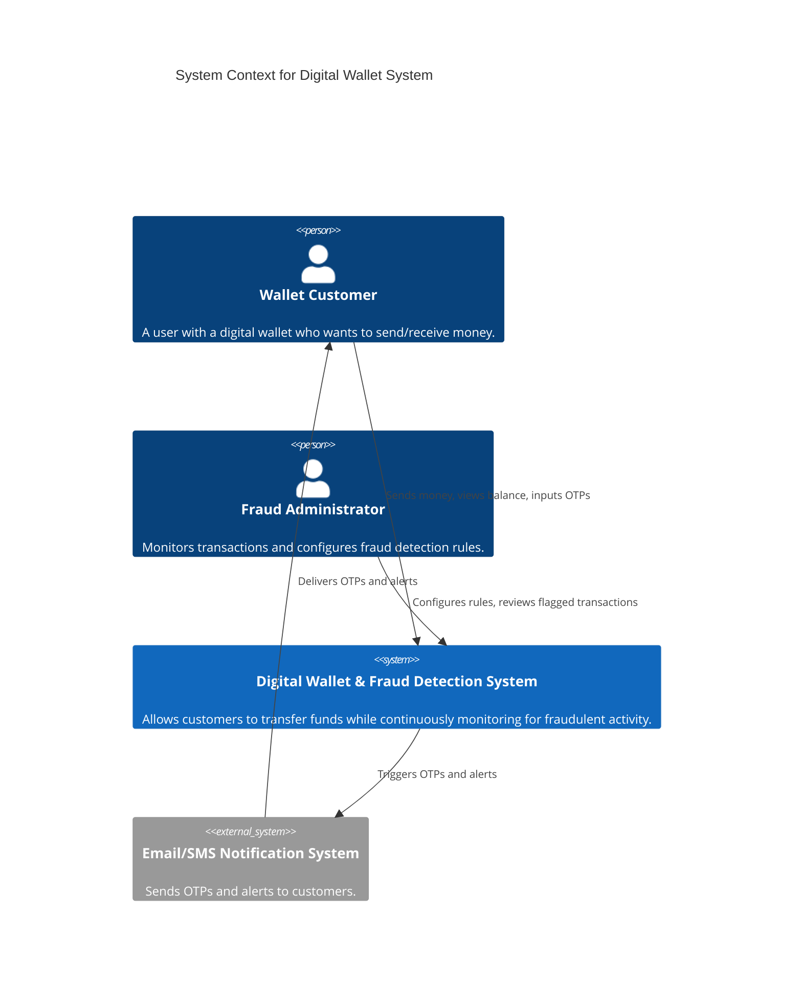
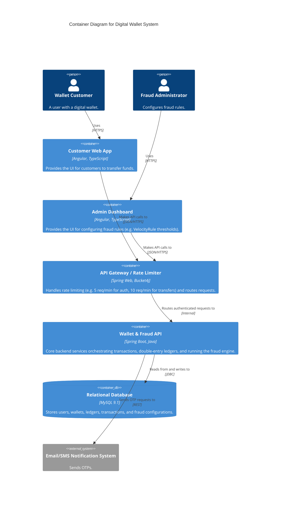

# C4 Model: Architecture Diagrams

This document visualizes the architecture of the Digital Wallet Fraud Detection System using the C4 model and Mermaid diagrams.

## Context Diagram (Level 1)
Shows how the system interacts with its users and external systems.

## Container Diagram (Level 2)
Zooming into the `Digital Wallet & Fraud Detection System` to see the high-level technical containers.

