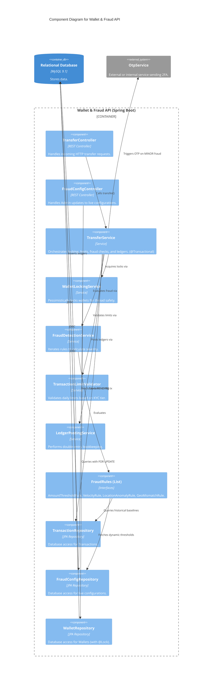

# Backend Component Architecture

This C4 Component diagram zooms into the Spring Boot API (`Wallet & Fraud API`) container, mapping the internal structure, dependency injection lines, and boundaries between domains.

## Component Diagram (Level 3)

