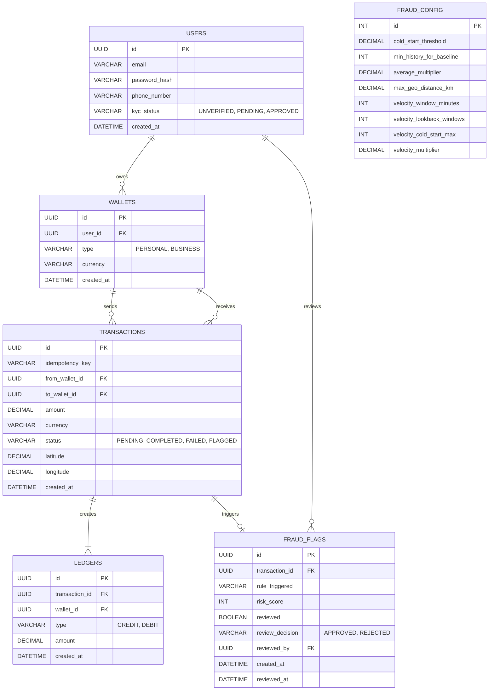

# Database Architecture

The Digital Wallet Fraud Detection system uses a relational database model (MySQL) to maintain ACID compliance for financial transfers while supporting complex fraud detection queries.

## Entity-Relationship Diagram (ERD)

## Core Tables Breakdown

### `wallets` & `ledgers`
To prevent race conditions, the system uses pessimistic locking on the `wallets` rows when a transfer occurs. Rather than storing a mutable "balance" column, the true balance is calculated dynamically by summing the `ledgers` table, ensuring strict double-entry bookkeeping.

### `transactions`
Acts as the central intent of a transfer. It is created first with a `PENDING` status. Depending on the fraud engine, it either moves to `COMPLETED` (and ledgers are written), `FAILED`, or `FLAGGED`.

### `fraud_config`
A singleton table (always `id = 1`) that acts as the real-time configuration store for the fraud engine. The Angular Admin Dashboard updates this row to tweak thresholds without requiring a backend redeployment.

### `fraud_flags`
If a transaction triggers a `MAJOR` fraud rule, a flag is written here. The transaction remains frozen until an admin reviews it and updates the `review_decision`.
