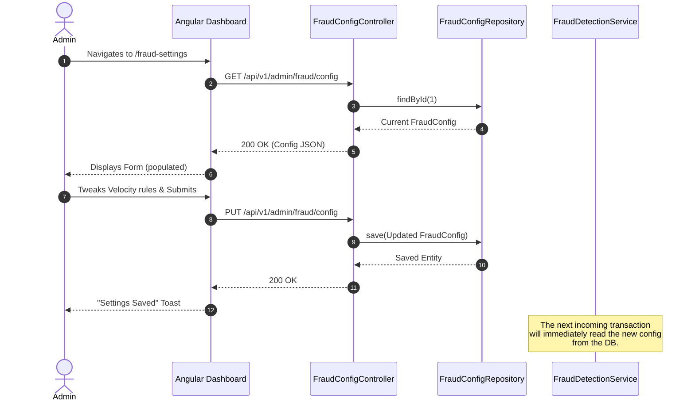

# Admin Config Update Flow

This sequence diagram illustrates how an Administrator updates the system's live fraud thresholds via the Angular Frontend. Because the engine queries the `FraudConfig` at runtime, the changes take effect instantly for all new transactions without a server deployment.

## Sequence Diagram

