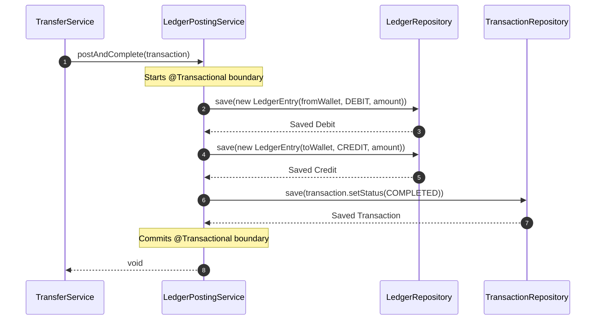

# Ledger Posting Flow

This sequence diagram explains the double-entry bookkeeping system handled by the `LedgerPostingService`. This strictly ensures that funds are never "lost" in transit, and that the total system value remains perfectly balanced.

## Sequence Diagram

