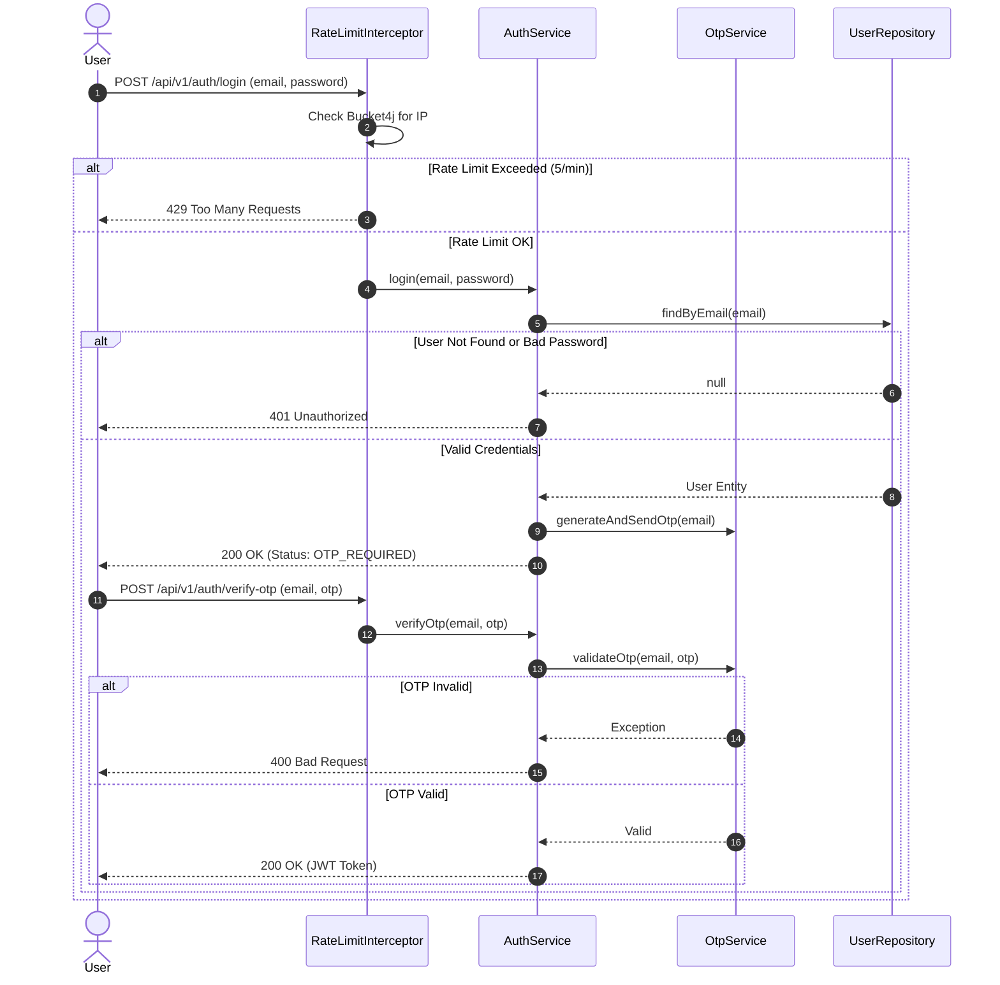

# Login & Rate Limiting Flow

This sequence diagram illustrates the authentication flow, emphasizing how the `RateLimitInterceptor` acts as a shield against brute force attacks.

## Sequence Diagram

