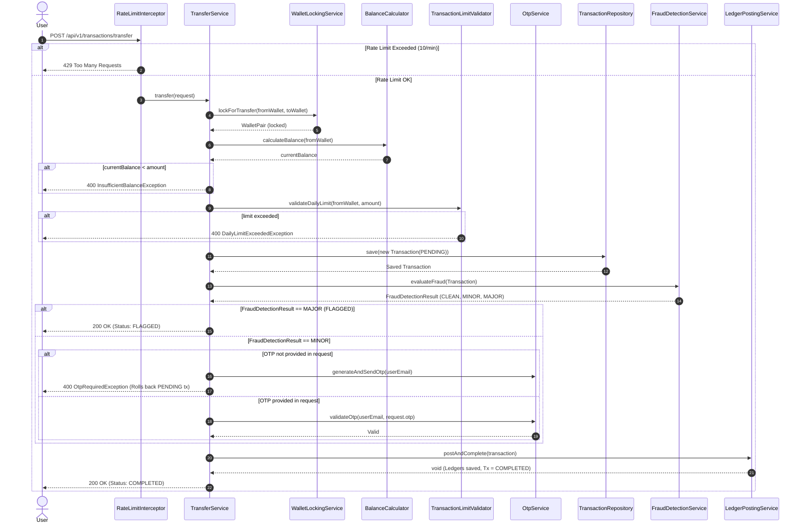

# Transaction & Step-Up Auth Workflow

This document details the lifecycle of a single `TransferRequest` as it moves through the `TransferService`, highlighting how locking, balance validation, fraud detection, and OTP Step-Up Authentication are sequenced.

## Sequence Diagram

