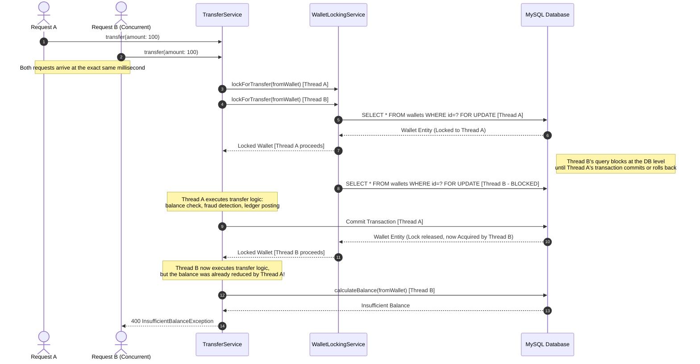

# Concurrency & Locking Workflow

This sequence diagram demonstrates how the `WalletLockingService` handles concurrent transfer requests using pessimistic database locking (`SELECT ... FOR UPDATE`). This prevents a race condition where a user with a $100 balance rapidly submits two $100 transfer requests, potentially double-spending.

## Sequence Diagram

