

  
  
  <h2 style="margin: 0; font-size: 16pt;">TRIBHUVAN UNIVERSITY</h2>
  
Office of the Dean

  
Faculty of Management

  
Kritipur, Kathmandu

  
  
|||

  
  
An Internship Report

  
On

   
  <h2 style="margin: 0; font-size: 16pt;">“Digital Wallet Fraud Detection System”</h2>
   
  
In partial fulfillment of requirement for the degree of

  
Bachelor of Information Management

  
(BIM)

  
|||

  
Submitted By:

  
Nishanta Koirala

  
Exam Roll No.: [Your Roll No]

  
TU Regd. No.: [Your Regd No]

   
  
[Your College Name e.g., NCCS]

  
[College Address e.g., Paknajol, Kathmandu]

  
October, 2026

# Recommendation Letter from the Intern Organization

*(Please attach the official recommendation/completion letter provided by Fonepay Payment Service Ltd. here. The letter should be printed on the company letterhead, signed by your supervisor or HR, and stamped.)*

# Recommendation Letter from the College

*(Please attach the official recommendation letter provided by your college/university coordinator here. It should confirm your eligibility and requirement for this internship program.)*

# Declaration

I hereby declare that this internship report entitled **"Digital Wallet Fraud Detection System"** submitted to [Your College/University Name] is an original record of my work carried out at **Fonepay Payment Service Ltd.** under the supervision of my industry supervisor. 

This report has been prepared in partial fulfillment of the requirements for my degree. I further declare that the work presented in this report has not been submitted in any other institution for the award of any other degree or diploma.

  
___________________________  
**Nishanta Koirala**  
Full Stack Developer Intern  
[Your College/University Name]  
Date: _______________  

# Approval Sheet

This is to certify that the internship report entitled **"Digital Wallet Fraud Detection System"** submitted by **Nishanta Koirala** has been examined and approved for the partial fulfillment of the requirements for the degree at [Your College/University Name].

  

**Approved By:**

  

___________________________  
**[Name of Supervisor]**  
Internship Supervisor  
[Your College/University Name]  
Date: _______________  

  

___________________________  
**[Name of HOD/Coordinator]**  
Head of Department / Program Coordinator  
[Your College/University Name]  
Date: _______________  

  

___________________________  
**[Name of External Examiner]**  
External Examiner  
Date: _______________  

# Acknowledgement

I would like to express my sincere gratitude to everyone who contributed to the successful completion of my internship and the preparation of this report. 

Foremost, I am deeply indebted to **Fonepay Payment Service Ltd.** for providing me with the opportunity to undertake this internship as a Full Stack Developer. The exposure to real-world fintech challenges and enterprise-grade software development has been invaluable.

I extend my heartfelt thanks to my industry supervisor at Fonepay for their continuous guidance, technical mentorship, and patient support throughout the development of the Digital Wallet Fraud Detection System. Their insights into financial security, concurrent systems, and modern web architectures significantly shaped my learning experience.

I also wish to express my gratitude to the faculty and administration of **[Your College/University Name]**, particularly my academic supervisor and the Head of the Department, for their academic support and for facilitating this internship program.

Lastly, I would like to thank my colleagues at Fonepay, my friends, and my family for their constant encouragement and motivation during this period.

 
**Nishanta Koirala**

# Abstract

The rapid growth of digital payment networks has necessitated advanced, real-time mechanisms to prevent financial fraud while maintaining high system availability and data consistency. This report details a three-month internship at Fonepay Payment Service Ltd., during which a comprehensive **Digital Wallet Fraud Detection System** was designed and developed as a prototype.

The project focused on building a robust, full-stack application using Java Spring Boot and Angular, supported by a MySQL database. Key technical achievements include the implementation of an ACID-compliant double-entry ledger with pessimistic concurrency locking, which ensures transaction integrity during concurrent operations. To address security concerns, a pluggable, rule-based fraud detection engine was developed. This engine evaluates transaction payloads in real-time against five independent behavioral signals: amount thresholds, transaction velocity, location anomalies, geographic mismatches, and device anomalies. 

Additionally, the system incorporates dynamic transaction limits based on Know Your Customer (KYC) verification tiers and features an administrative review workflow for transactions flagged as high-risk, moving beyond simple automated blocking. The development followed a phased approach, encompassing requirement analysis, UML and DFD process modeling, backend microservices architecture, and frontend integration. The resulting system successfully demonstrates how proactive fraud prevention can be seamlessly embedded into the core transaction pipeline of modern digital wallets.

*Keywords: Internship, Digital Wallet Fraud Detection System, Spring Boot, Angular, Double-Entry Ledger, Role-Based Access Control, Rule Engine*

# Table of Contents

1. [Preliminary Section](#)
   - [Recommendation Letter from the Intern Organization](#recommendation-letter-from-the-intern-organization)
   - [Recommendation Letter from the College](#recommendation-letter-from-the-college)
   - [Declaration](#declaration)
   - [Approval Sheet](#approval-sheet)
   - [Acknowledgement](#acknowledgement)
   - [Abstract](#abstract)
   - [List of Tables](#list-of-tables)
   - [List of Figures](#list-of-figures)
   - [Acronyms](#acronyms)
2. [Chapter 1: Introduction](#chapter-1-introduction)
   - [1.1 Background](#11-background)
   - [1.2 Focus of the Study](#12-focus-of-the-study)
   - [1.3 Statement of the Problem](#13-statement-of-the-problem)
   - [1.4 Objective of Study](#14-objective-of-study)
   - [1.5 Review of Literature](#15-review-of-literature)
   - [1.6 Limitation of the Study](#16-limitation-of-the-study)
3. [Chapter 2: Brief Introduction to the Industry](#chapter-2-brief-introduction-to-the-industry)
   - [2.1 Introduction to the IT Industry](#21-introduction-to-the-it-industry)
   - [2.2 Types of IT Companies](#22-types-of-it-companies)
   - [2.3 Fintech and Digital Payment Sector](#23-fintech-and-digital-payment-sector)
4. [Chapter 3: Brief Introduction to the Organization](#chapter-3-brief-introduction-to-the-organization)
   - [3.1 Introduction of the Organization](#31-introduction-of-the-organization)
   - [3.2 Goals and Objectives of the Organization](#32-goals-and-objectives-of-the-organization)
   - [3.3 Organizational Structure](#33-organizational-structure)
   - [3.4 Services Provided by the Organization](#34-services-provided-by-the-organization)
   - [3.5 Projects Done](#35-projects-done)
5. [Chapter 4: Activities Done](#chapter-4-activities-done)
   - [4.1 System Introduction / Description](#41-system-introduction--description)
   - [4.2 Weekly Activities Done at Internship Office](#42-weekly-activities-done-at-internship-office)
   - [4.3 System Analysis of the Project](#43-system-analysis-of-the-project)
   - [4.4 Full Stack Developer – Detailed Analysis](#44-full-stack-developer--detailed-analysis)
     - [4.4.a System Analysis](#44a-system-analysis)
     - [4.4.b Requirement Discovery: Use-Case Diagram](#44b-requirement-discovery-use-case-diagram)
     - [4.4.c Data Modeling: Database Design](#44c-data-modeling-database-design)
     - [4.4.d Process Modeling: UML Diagrams and DFD](#44d-process-modeling-uml-diagrams-and-dfd)
     - [4.4.e Feasibility Analysis](#44e-feasibility-analysis)
     - [4.4.f System Development](#44f-system-development)
     - [4.4.g System Implementation](#44g-system-implementation)
6. [Chapter 5: Conclusion and Recommendation](#chapter-5-conclusion-and-recommendation)
   - [5.1 Conclusion](#51-conclusion)
   - [5.2 Recommendation](#52-recommendation)
7. [Bibliography](#bibliography)
8. [Annexes](#annexes)

# List of Tables

- Table 2.1: Types of IT Companies
- Table 3.1: Services Provided by the Organization
- Table 4.1: System Summary
- Table 4.2: Weekly Activities Done at Internship Office
- Table 4.3: Functional Requirements
- Table 4.4: Non-Functional Requirements
- Table 4.5: Backend Module Breakdown
- Table 4.6: Economic Feasibility Estimate
- Table 4.7: Tools and Technologies Used
- Table 4.8: Test Types and Scope
- Table 4.9: Test Cases
- Table A.1: API Endpoint Summary
- Table A.2: Technology Version Matrix

# List of Figures

- Figure 1.1: Internship Gantt Chart
- Figure 3.1: Organizational Structure
- Figure 4.1: Use-Case Diagram (User)
- Figure 4.2: Use-Case Diagram (Admin)
- Figure 4.3: Use-Case Diagram (Merchant)
- Figure 4.4: Entity-Relationship (ER) Diagram
- Figure 4.5: Class Diagram
- Figure 4.6: Sequence Diagram
- Figure 4.7: Activity Diagram
- Figure 4.8: Component Diagram
- Figure 4.9: Level 0 DFD (Context Diagram)
- Figure 4.10: Level 1 DFD

# Acronyms

| Acronym | Full Form |
|---|---|
| **ACID** | Atomicity, Consistency, Isolation, Durability |
| **AML** | Anti-Money Laundering |
| **API** | Application Programming Interface |
| **BPO** | Business Process Outsourcing |
| **CAGR** | Compound Annual Growth Rate |
| **DFD** | Data Flow Diagram |
| **ERD** | Entity-Relationship Diagram |
| **IT** | Information Technology |
| **ITES** | IT-Enabled Services |
| **JWT** | JSON Web Token |
| **KYC** | Know Your Customer |
| **ML** | Machine Learning |
| **NFC** | Near-Field Communication |
| **NRB** | Nepal Rastra Bank |
| **OTP** | One-Time Password |
| **P2M** | Person-to-Merchant |
| **P2P** | Person-to-Person |
| **PSP** | Payment Service Provider |
| **QA** | Quality Assurance |
| **RBAC** | Role-Based Access Control |
| **RDBMS** | Relational Database Management System |
| **SPA** | Single-Page Application |
| **UML** | Unified Modeling Language |
| **UUID** | Universally Unique Identifier |

# CHAPTER 1: INTRODUCTION

## 1.1 Background

The rapid proliferation of digital payment systems across the globe has fundamentally transformed the way financial transactions are conducted. In Nepal, mobile payment adoption has accelerated significantly over the past few years, driven by smartphones, internet penetration, and the emergence of platforms such as Fonepay, eSewa, and Khalti. According to the Nepal Rastra Bank's annual payment system report, digital wallet transactions exceeded NPR 1 trillion in the fiscal year 2024/25, representing a year-over-year growth of over 40%.

As digital financial systems grow in usage, they simultaneously become high-value targets for fraudulent actors. Financial fraud in digital ecosystems takes many forms: account takeover attacks, velocity fraud (rapid-fire small transactions), geo-location spoofing, and social engineering-assisted unauthorized transfers. The consequences of fraud extend beyond monetary loss — they erode consumer trust, attract regulatory scrutiny, and damage the reputational capital of financial service providers.

Traditional banking systems relied on rule-based filters and post-transaction audits to detect anomalies. While such approaches remain in use, they suffer from two fundamental weaknesses: they are reactive in nature and they cannot adapt in real time to evolving threat patterns. There is thus a clear and urgent need for proactive, real-time fraud detection systems embedded directly within the payment processing pipeline.

This internship was undertaken at Fonepay Payment Service Ltd., one of Nepal's leading fintech companies, with the objective of designing and developing a **Digital Wallet Fraud Detection System**. The system incorporates a double-entry ledger engine, KYC-based transaction limits, a pluggable rule-based fraud detection engine, and an admin review workflow — all delivered through a modern full-stack architecture using Java Spring Boot on the backend and Angular on the frontend.

## 1.2 Focus of the Study

This study focuses on the design, development, and partial deployment of a digital wallet system with embedded, real-time fraud detection capabilities. Specifically, the study examines:

1. The architecture and implementation of a fraud detection engine using a pluggable rule-based approach.
2. The design of a double-entry ledger system for ACID-compliant financial transactions.
3. The enforcement of KYC-based dynamic transaction limits.
4. The implementation of an administrative review and approval workflow for flagged transactions.
5. The role of full-stack development (Spring Boot + Angular) in building secure, scalable fintech applications.

The project is scoped as a simulation and development prototype, not a production deployment, and is intended to demonstrate technical competence in building enterprise-grade financial software systems.

## 1.3 Statement of the Problem

Despite the growth of digital wallets in Nepal, existing platforms often lack transparent, configurable, real-time fraud detection capabilities integrated directly into the transaction pipeline. A major issue is reactive detection, where fraud is often identified after the fact through batch processing or manual audits, by which time funds have already been moved. Furthermore, platforms rely heavily on static monetary thresholds that fail to account for a user's transaction history and spending baseline, leading to both false positives and false negatives. There is also a significant lack of multi-factor fraud signals; many systems check only the transaction amount while ignoring behavioral signals such as transaction velocity, geographic location, device fingerprint, and IP address. Additionally, existing systems suffer from the absence of an admin oversight workflow, meaning flagged suspicious transactions are either auto-blocked or auto-approved with no middle ground for human review. Finally, transaction limits are often static and KYC-blind, meaning they do not scale dynamically with a user's verified identity and trust level.

This project addresses these gaps by building a comprehensive system where fraud detection is a first-class concern, embedded into the core transaction processing pipeline, with configurable rules, KYC-aware limits, and a structured admin review workflow.

## 1.4 Objective of Study

### General Objective

To design and develop a digital wallet system with integrated, real-time fraud detection using a rule-based engine, administered through a web-based interface built with Java Spring Boot and Angular.

### Specific Objectives

1. To implement a secure user authentication system with JWT-based session management and role-based access control (RBAC).
2. To design and implement a double-entry ledger system ensuring ACID-compliant fund transfers.
3. To build a pluggable, rule-based fraud detection engine that evaluates transaction payloads against multiple behavioral signals.
4. To enforce dynamic transaction limits based on a user's KYC verification status.
5. To implement an admin review workflow where flagged transactions are held pending manual approval or rejection.
6. To develop a responsive Angular frontend providing dashboards, fraud review queues, KYC review, and audit logs.
7. To design a normalized relational database schema in MySQL and manage its evolution using Flyway migrations.

## 1.5 Review of Literature

### 1.5.1 Digital Wallets and Payment Systems

The concept of electronic wallets, or e-wallets, has been extensively studied in the context of mobile commerce and fintech. Ramos et al. (2022) define a digital wallet as "a software-based system that securely stores users' payment information and passwords for numerous payment methods and websites." The adoption of digital wallets has been attributed to the convergence of NFC technology, smartphone proliferation, and the global push for cashless economies following the COVID-19 pandemic.

### 1.5.2 Fraud Detection Techniques

Wang (2024) identifies that fraud detection in digital payment technologies primarily employs two paradigms: rule-based systems and machine learning (ML) based models. Rule-based systems are deterministic — they apply expert-defined thresholds and conditions — and are highly interpretable and auditable, making them preferable in regulated financial environments.

Abdirahman et al. (2024) conducted a comparative study of fraud detection across five prominent mobile wallet platforms, finding that the integration of velocity checks, geo-spatial anomaly detection, and amount-baseline comparisons yields a precision rate of up to 94% when combined in an ensemble rule-based model.

### 1.5.3 Double-Entry Bookkeeping in Digital Systems

The application of double-entry accounting principles to digital ledger systems is well-established. Furlonger and Valdes (2019) demonstrate that double-entry ledgers remain the gold standard for maintaining financial integrity in software systems. Every debit must be matched by an equivalent credit, and balances are always derived from ledger entries rather than stored as a mutable field — a design that eliminates the possibility of "phantom balance" inconsistencies under concurrent access.

### 1.5.4 Pessimistic Locking and Concurrency in Financial Systems

Concurrency management in financial databases is critical. Kleppmann (2017) explains in *Designing Data-Intensive Applications* that pessimistic concurrency control — specifically, `SELECT ... FOR UPDATE` row-level locking — is the appropriate mechanism for multi-entity financial transactions because it prevents both dirty reads and phantom reads. Consistent lock ordering (always locking the wallet with the smaller ID first) is identified as the standard technique to prevent deadlocks.

### 1.5.5 Spring Boot and Angular in Enterprise Fintech

Spring Boot is recognized as the dominant framework for enterprise Java applications, offering auto-configuration, embedded servers, and a rich ecosystem for security, data persistence, and API development (Walls, 2022). The Angular framework provides a component-based, TypeScript-first approach to building single-page applications (Freeman, 2022).

## 1.6 Limitation of the Study

1. **Simulation Environment:** The system operates on a simulated dataset and does not process real financial transactions.
2. **Rule-Based Only:** The fraud engine is entirely rule-based. Machine learning models were not implemented due to time and data constraints.
3. **No External API Integrations:** The system does not integrate with real payment networks or third-party KYC verification services.
4. **Single-Currency:** The current implementation supports NPR only. Multi-currency support would require an exchange rate service.
5. **OTP Service Stub:** The OTP step-up authentication triggered by minor fraud flags references an external OTP service treated as a mock during development.
6. **No Production Deployment:** The system was run locally using a MySQL instance and Angular development server.

## 1.7 Gantt Chart

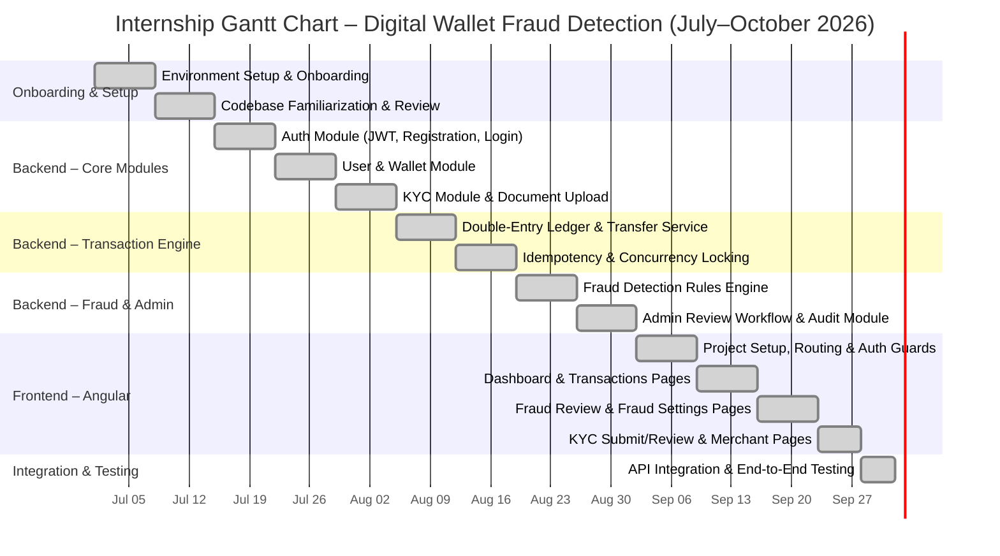

Figure 1.1: Internship Gantt Chart

# CHAPTER 2: BRIEF INTRODUCTION TO THE INDUSTRY

## 2.1 Introduction to the IT Industry

The Information Technology (IT) industry is one of the fastest-growing sectors in the global economy. It encompasses the development, management, and use of computer-based information systems, software applications, and telecommunications networks to store, retrieve, transmit, and manipulate data. According to Statista (2024), the global IT industry was valued at approximately USD 5.3 trillion in 2023 and is projected to grow at a CAGR of 7.9% through 2028.

In Nepal, the IT sector has grown significantly over the past decade. Nepal's IT export revenue crossed NPR 90 billion in 2024, primarily driven by software development, IT-enabled services (ITES), and fintech innovation. The government's "Digital Nepal Framework" and the Nepal Rastra Bank's (NRB) regulatory sandbox for fintech companies have further catalyzed innovation in digital payments and financial technology.

## 2.2 Types of IT Companies

IT companies can be broadly classified into the following categories:

Table 2.1: Types of IT Companies

| Type | Description | Examples |
|------|-------------|---------|
| **Product-Based** | Develop proprietary software products sold to customers | Microsoft, Adobe, eSewa |
| **Service-Based** | Provide software development and consulting services to clients | Infosys, Deloitte Digital |
| **Fintech** | Apply technology to financial services including payments, lending, and insurance | Fonepay, Khalti, Stripe |
| **Cloud & Infrastructure** | Provide cloud computing and data center infrastructure | AWS, Azure, Google Cloud |
| **Cybersecurity** | Specialize in protecting digital systems from threats | Palo Alto Networks, CrowdStrike |
| **E-Commerce** | Online retail and marketplace platforms | Daraz, SastoDeal |
| **IT-Enabled Services (ITES)** | BPO, call centers, data processing | Ncell, WorldLink |

## 2.3 Fintech and Digital Payment Sector

Financial Technology (Fintech) represents the intersection of finance and technology. The global fintech market was valued at USD 226 billion in 2023 (Statista, 2024) and is anticipated to exceed USD 917 billion by 2032, driven by mobile banking, blockchain, open banking APIs, and AI-driven fraud prevention.

**Key characteristics of the Fintech sector:**

- **Regulatory Compliance:** Fintech companies operate under strict financial regulation. In Nepal, payment service providers are licensed and regulated by Nepal Rastra Bank (NRB) under the Payment and Settlement Act, 2019.
- **Security-First Design:** Fintech systems apply multiple layers of security including end-to-end encryption, multi-factor authentication, and anomaly detection.
- **API Economy:** Modern fintech systems expose and consume APIs, enabling interoperability between banks, payment networks, and third-party applications.
- **Real-Time Processing:** Digital payment systems are expected to process and respond to transactions in milliseconds.
- **KYC and AML Compliance:** Know Your Customer (KYC) and Anti-Money Laundering (AML) compliance are mandatory for all licensed payment providers.

Nepal's digital payment ecosystem is dominated by a few key players — Fonepay (as a payment network), eSewa and Khalti (as wallet providers), and ConnectIPS (for interbank transfers). Fonepay operates as a payment switch and gateway, connecting banks, cooperatives, and fintech wallets into a unified QR-based payment network.

# CHAPTER 3: BRIEF INTRODUCTION TO THE ORGANIZATION

## 3.1 Introduction of the Organization

**Fonepay Payment Service Ltd.** is Nepal's leading digital payment network and one of the country's premier fintech companies. Established under the Payment and Settlement Act, 2019, and licensed by Nepal Rastra Bank, Fonepay operates as an interoperable payment switch that connects banks, financial institutions, cooperatives, and digital wallets across Nepal.

Fonepay introduced Nepal's first unified QR code payment standard, enabling consumers to make payments to any merchant or individual using a single scan, regardless of which bank or wallet app they use. The company's technology infrastructure processes millions of transactions daily across its connected member banks and partner institutions.

**Key facts:**
- **Founded:** 2015
- **Headquarters:** Kathmandu, Nepal
- **Parent Company:** F1Soft International Pvt. Ltd.
- **Regulatory Status:** Licensed by Nepal Rastra Bank as a Payment Service Provider (PSP)
- **Core Product:** Fonepay QR – Nepal's national QR payment standard adopted by 90%+ of commercial banks

## 3.2 Goals and Objectives of the Organization

**Vision:** To be the foremost digital payment network in Nepal, enabling a fully inclusive, interoperable, and secure financial ecosystem.

**Mission:** To provide reliable, scalable, and secure payment infrastructure that connects all financial entities in Nepal, fostering digital financial inclusion for every citizen.

**Core Objectives:**
1. To develop and maintain a secure, high-availability national payment switch for Nepal.
2. To promote financial inclusion by extending digital payment access to unbanked and underbanked populations.
3. To continuously innovate payment products aligned with NRB directives and global fintech trends.
4. To ensure regulatory compliance with Nepal Rastra Bank's Payment and Settlement guidelines.
5. To foster a developer ecosystem through APIs and an open developer portal.
6. To implement robust security and fraud prevention measures protecting consumers and member institutions.

## 3.3 Organizational Structure

Fonepay follows a functional organizational structure typical of fintech companies, with specialized departments for technology, product, operations, compliance, and business development.

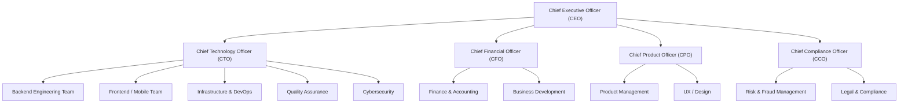

Figure 3.1: Organizational Structure

> The intern (Nishanta Koirala) was placed under the **Backend Engineering Team**, reporting to a senior backend developer and working closely with the Frontend and QA teams during integration phases.

## 3.4 Services Provided by the Organization

Table 3.1: Services Provided by the Organization

| Service | Description |
|---------|-------------|
| **Fonepay QR** | Nepal's national interoperable QR payment standard for P2M and P2P payments |
| **Payment Gateway** | API-based payment processing for e-commerce platforms and third-party applications |
| **Payment Switch** | Routing and settlement of inter-bank digital transactions |
| **Developer Portal** | Portal for third-party developers to access Fonepay APIs, documentation, and SDKs |
| **Bill Payment** | Utility and service bill payment through the Fonepay network |
| **Merchant Onboarding** | Automated merchant registration and QR code generation for retail merchants |
| **Fraud Monitoring** | Real-time transaction monitoring and fraud prevention for connected institutions |
| **Reporting & Analytics** | Transaction dashboards and analytics for member banks and merchants |

## 3.5 Projects Done

During the internship period, the primary project undertaken was the **Digital Wallet Fraud Detection System** — a full-stack web application simulating a modern digital wallet with an embedded fraud detection engine. This project was developed as an internal R&D initiative to explore and prototype rule-based fraud detection techniques applicable to Fonepay's payment infrastructure.

Other notable projects observed at Fonepay during the internship period include enhancements to the Fonepay Developer Portal, refactoring of the merchant onboarding microservice, and a proof-of-concept for real-time transaction streaming analytics.

# CHAPTER 4: ACTIVITIES DONE

## 4.1 System Introduction

The Digital Wallet Fraud Detection System is a comprehensive web-based application designed to facilitate secure financial transactions while actively monitoring and preventing fraudulent activities in real time. The system provides a centralized platform for users to manage their digital wallets, process fund transfers, and submit KYC documentation, thereby reducing reliance on manual oversight and improving the overall security of the payment ecosystem.

The system supports the complete transaction lifecycle, from the initiation of a fund transfer to its final ledger posting, all while executing complex fraud evaluations in the background. It incorporates role-based access control to ensure secure and structured system usage across different user groups, including standard users, merchants, and system administrators. The system also features a dynamic fraud detection engine, KYC-based transaction limits, and a dedicated administrative dashboard for reviewing and manually approving highly suspicious transactions.

Built using modern technologies such as Java Spring Boot for the backend API, Angular for the frontend, and MySQL for robust database management, the system ensures enterprise-grade scalability, security, and reliability. By utilizing an ACID-compliant double-entry ledger and real-time behavioral analytics, the application guarantees data integrity and proactive threat mitigation. Overall, the Digital Wallet Fraud Detection System represents a modern, highly secure digital solution for efficient financial management and fraud prevention in the contemporary fintech landscape.

### System Summary

Table 4.1: System Summary

| Property | Value |
|----------|-------|
| **System Name** | Digital Wallet Fraud Detection System |
| **Backend** | Java 26, Spring Boot 4.1.0, Maven |
| **Frontend** | Angular 18, TypeScript, SCSS |
| **Database** | MySQL 9.1 with Flyway migrations |
| **Security** | Spring Security, JWT Authentication |
| **Rate Limiting** | Bucket4j |
| **API Style** | RESTful HTTP JSON APIs |

### Core Features

- **Double-Entry Ledger:** Every fund transfer creates a linked debit/credit ledger pair; account balance is always derived from ledger entries, never stored as a mutable field.
- **Idempotent Transfers:** Client-supplied idempotency keys prevent duplicate processing on network retries.
- **Deadlock-Safe Concurrency:** Pessimistic row-level locking with consistent lock ordering prevents race conditions under concurrent access.
- **Multi-Signal Fraud Detection:** A pluggable rule-based engine evaluates each transaction against five independent fraud rules: amount threshold, velocity, location anomaly, geo-mismatch, and device anomaly.
- **KYC-Based Limits:** Daily transaction limits dynamically scale with the user's KYC verification tier.
- **Admin Review Workflow:** Transactions flagged with MAJOR severity are held pending admin approval or rejection.
- **QR Code Payments:** QR code generation and scanning for P2P and P2M payment flows.
- **Audit Logging:** Asynchronous, immutable logging of critical actions.

## 4.2 Weekly Activities Done at Internship Office

Table 4.2: Weekly Activities Done at Internship Office

| Week | Period | Activities |
|------|--------|------------|
| **Week 1** | Jul 1–7 | Organization onboarding, HR documentation, workstation setup, Java/Spring Boot environment configuration, codebase and Git repository orientation |
| **Week 2** | Jul 8–14 | Studied existing Fonepay architecture, reviewed NRB payment compliance guidelines, designed system architecture and module breakdown |
| **Week 3** | Jul 15–21 | Implemented User Registration, Login, and JWT Authentication module using Spring Security; integrated BCrypt password hashing |
| **Week 4** | Jul 22–28 | Developed User Profile and Wallet Module; implemented personal and business wallet creation per user account |
| **Week 5** | Jul 29–Aug 4 | Built KYC Module: document upload, admin KYC review and approval, KYC status transitions (NOT_SUBMITTED → PENDING → APPROVED) |
| **Week 6** | Aug 5–11 | Implemented Transfer Service with double-entry ledger (LedgerPostingService), ACID-compliant fund transfer orchestration, and idempotency key handling |
| **Week 7** | Aug 12–18 | Added pessimistic locking (WalletLockingService) for concurrent transfer safety; implemented TransactionLimitValidator for KYC-based daily limits |
| **Week 8** | Aug 19–25 | Designed and implemented the fraud detection engine: FraudRule interface, AmountThresholdRule, VelocityRule, LocationAnomalyRule, GeoMismatchRule, DeviceAnomalyRule |
| **Week 9** | Aug 26–Sep 1 | Built Admin Review Workflow for flagged transactions; implemented Audit Module with asynchronous logging; developed FraudConfig admin endpoint for dynamic rule tuning |
| **Week 10** | Sep 2–8 | Angular frontend setup: routing, auth guards, interceptors, login/register pages |
| **Week 11** | Sep 9–15 | Built Angular Dashboard page, Transaction History page, and QR payment screen |
| **Week 12** | Sep 16–22 | Built Fraud Review queue, Fraud Settings configuration, and Admin Analytics/Reports pages |
| **Week 13** | Sep 23–27 | Built KYC Submit, KYC Review, Merchant Onboarding, and Merchant Review pages |
| **Week 14** | Sep 28–Oct 1 | End-to-end API integration, bug fixing, manual testing, and report writing |

## 4.3 System Analysis of the Project

### 4.3.1 Functional Requirements

Table 4.3: Functional Requirements

| ID | Requirement |
|----|-------------|
| FR-01 | Users shall be able to register, login, and manage their profile |
| FR-02 | Each user shall have a personal and/or business digital wallet |
| FR-03 | Users shall be able to initiate fund transfers between wallets |
| FR-04 | All transfers shall be processed as double-entry ledger entries |
| FR-05 | Each transfer request shall be evaluated by the fraud detection engine before committing |
| FR-06 | Transactions flagged as MINOR fraud shall trigger an OTP step-up |
| FR-07 | Transactions flagged as MAJOR fraud shall be held for admin review |
| FR-08 | Admins shall be able to approve or reject flagged transactions |
| FR-09 | Users shall be able to submit KYC documents for identity verification |
| FR-10 | Admins shall be able to review and approve/reject KYC submissions |
| FR-11 | Transaction limits shall be enforced based on the user's KYC status |
| FR-12 | Users shall be able to make and receive QR code payments |
| FR-13 | All critical actions shall be immutably audit-logged |
| FR-14 | Admins shall be able to configure fraud detection rule thresholds dynamically |

### 4.3.2 Non-Functional Requirements

Table 4.4: Non-Functional Requirements

| ID | Requirement |
|----|-------------|
| NFR-01 | API response time shall be under 300ms for standard operations under normal load |
| NFR-02 | The system shall prevent duplicate transaction processing (idempotency) |
| NFR-03 | Concurrent transfers shall not cause data races or deadlocks |
| NFR-04 | JWT tokens shall expire after 1 hour; refresh tokens after 7 days |
| NFR-05 | All passwords shall be stored as BCrypt hashes, never in plaintext |
| NFR-06 | The system shall be role-based: USER, MERCHANT, ADMIN roles with distinct permissions |
| NFR-07 | API rate limiting shall prevent brute-force and DoS attacks |
| NFR-08 | Audit logs shall be immutable and asynchronously written |
| NFR-09 | The Angular frontend shall be responsive and support modern browsers |

---

## 4.4 Full Stack Developer – Detailed Analysis

### 4.4.a System Analysis

The system follows a **layered modular monolith** architecture for the backend, with clear separation between the REST controller layer, the service/business logic layer, the repository/data access layer, and the domain model layer. The frontend is a separate Angular SPA communicating exclusively via RESTful JSON APIs.

Table 4.5: Backend Module Breakdown

| Module | Responsibility |
|--------|----------------|
| `auth` | User registration, login, JWT token issuance and validation |
| `user` | User profile management, role management |
| `wallet` | Wallet creation, balance queries, locking service |
| `transaction` | Transfer orchestration, ledger posting, idempotency |
| `fraud` | Rule-based fraud detection engine, fraud flag management, admin config |
| `kyc` | KYC document submission, admin review, status transitions |
| `merchant` | Merchant profile creation and management |
| `admin` | Admin-specific dashboards, analytics, and review workflows |
| `audit` | Asynchronous audit event logging |
| `statement` | Transaction history and statement generation |

### 4.4.b Requirement Discovery: Use-Case Diagram

The system has three primary actors: **User** (regular wallet holder), **Admin** (internal staff with elevated privileges), and **Merchant** (a business entity that accepts payments).

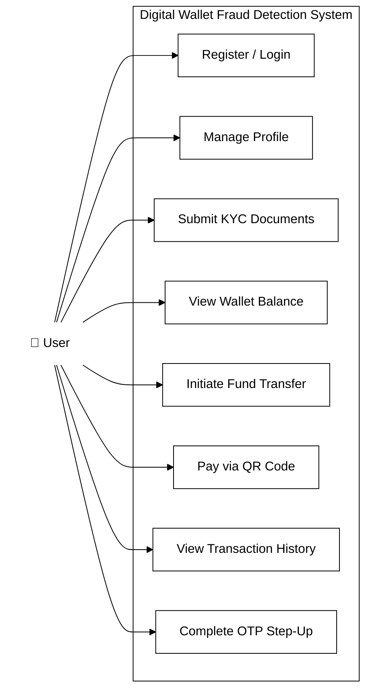

Figure 4.1: Use-Case Diagram (User)

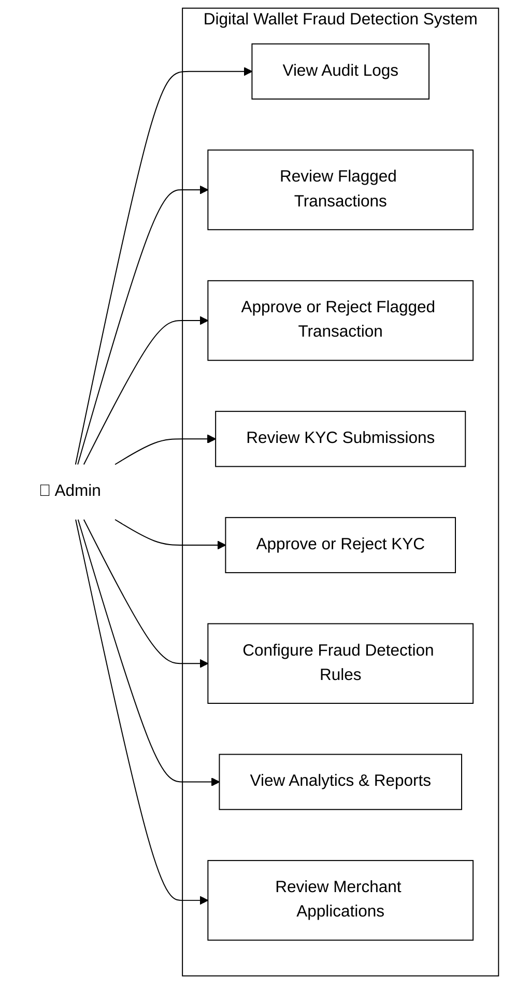

Figure 4.2: Use-Case Diagram (Admin)

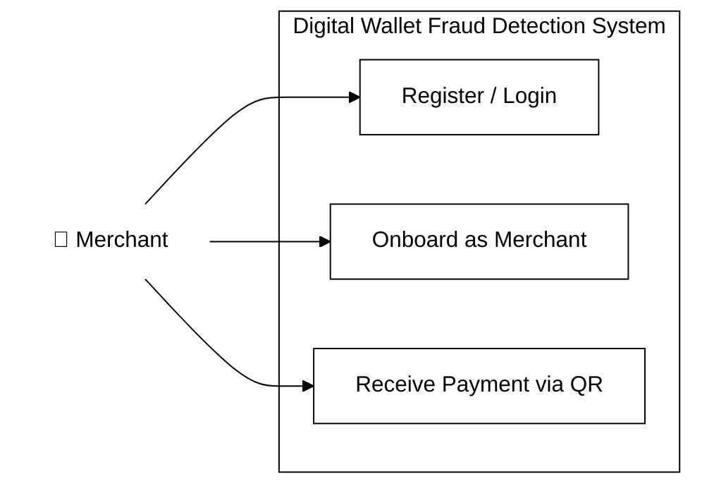

Figure 4.3: Use-Case Diagram (Merchant)

### 4.4.c Data Modeling: Database Design

#### Conceptual Design

The system revolves around the following key entities and their high-level relationships:

- A **User** can own one or more **Wallets** (PERSONAL and/or BUSINESS)
- A **User** can submit **KYC Documents**
- A **Wallet** is involved in **Transactions** as either sender or receiver
- Each **Transaction** generates exactly two **Ledger Entries** (one DEBIT, one CREDIT)
- A **Transaction** may be associated with a **Fraud Flag** if flagged by the detection engine
- A **Merchant** profile is linked to a **User**

#### Logical Design – ER Diagram

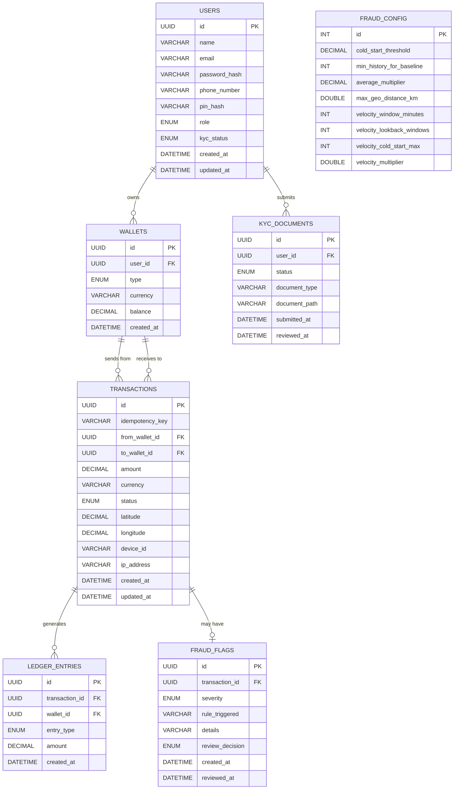

Figure 4.4: Entity-Relationship (ER) Diagram

#### Physical Design

The physical design maps the logical entities to actual MySQL 9.1 tables using InnoDB engine with utf8mb4 charset. Key physical design decisions include:

- **UUID as Primary Key:** All entity IDs are stored as `CHAR(36)` UUID strings for globally unique identification.
- **ENUM stored as VARCHAR:** JPA `@Enumerated(EnumType.STRING)` maps enumerations to VARCHAR columns, ensuring readability in raw DB queries.
- **Pessimistic Locking:** The `wallets` table is designed to support `SELECT ... FOR UPDATE` row-level locking via JPA's `@Lock(LockModeType.PESSIMISTIC_WRITE)`.
- **Flyway Migrations:** Schema evolution is managed through versioned Flyway SQL scripts (V1, V2, V3), ensuring reproducible deployments.
- **Indexing:** Foreign key columns and frequently-queried fields (`status`, `created_at`) are indexed.

### 4.4.d Process Modeling: UML Diagrams and DFD

#### i. Object-Oriented – UML Diagrams

##### a. Class Diagram

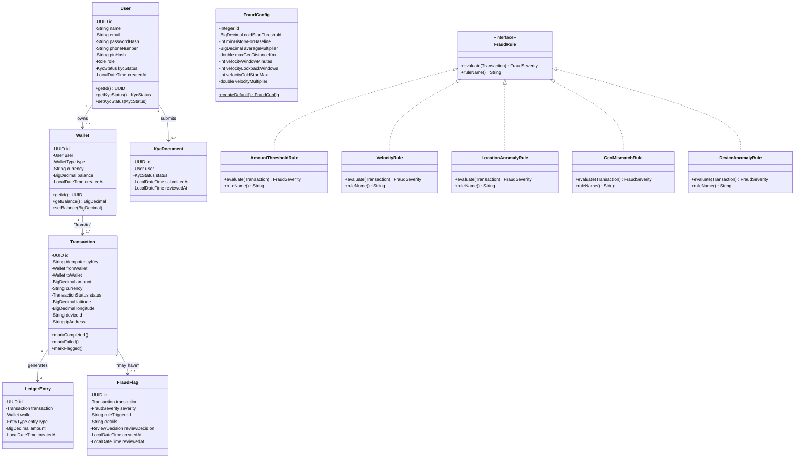

Figure 4.5: Class Diagram

##### b. Sequence Diagram

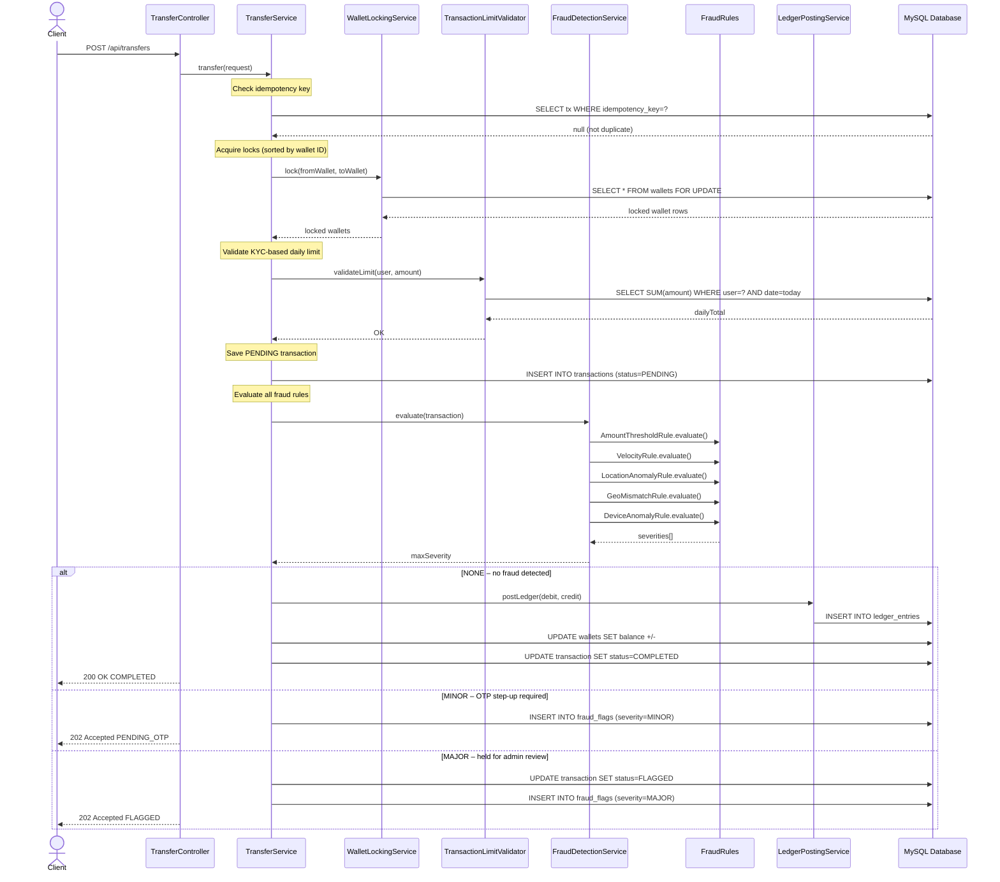

Figure 4.6: Sequence Diagram

##### c. Activity Diagram

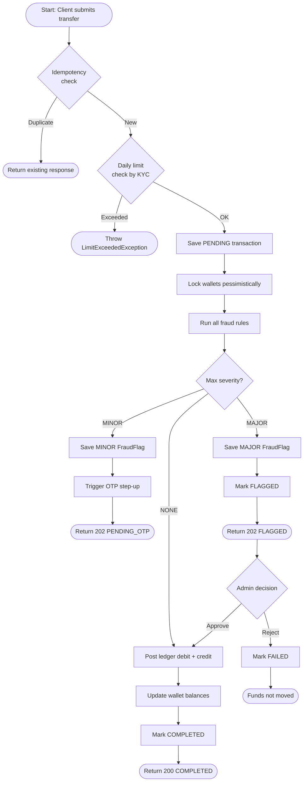

Figure 4.7: Activity Diagram

##### d. Component Diagram

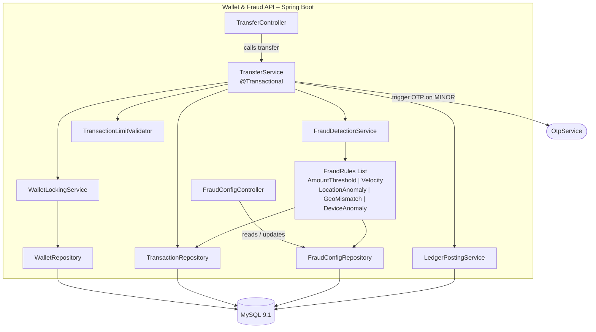

Figure 4.8: Component Diagram

#### ii. Structured – Data Flow Diagrams

##### Level 0 DFD (Context Diagram)

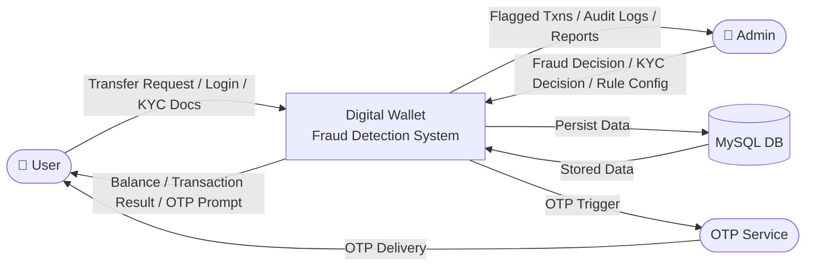

Figure 4.9: Level 0 DFD (Context Diagram)

##### Level 1 DFD

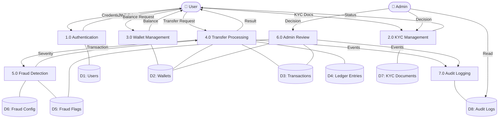

Figure 4.10: Level 1 DFD

### 4.4.e Feasibility Analysis

#### Technical Feasibility

The chosen technology stack is well-established and proven in enterprise financial applications:

- **Java 26 + Spring Boot 4.1.0** is the industry standard for backend financial systems.
- **Angular 18** is a Google-maintained, enterprise-grade frontend framework.
- **MySQL 9.1** provides full ACID guarantees suitable for transactional financial data.
- **Flyway** ensures reliable, version-controlled database schema management.

**Conclusion: Technically Feasible.**

#### Operational Feasibility

- Fraud detection is a core operational requirement for any payment service provider.
- The admin review workflow fills a gap in existing systems that offer no human-in-the-loop option.
- The Angular dashboard provides an intuitive interface requiring no specialized training for admin users.

**Conclusion: Operationally Feasible.**

#### Economic Feasibility

Table 4.6: Economic Feasibility Estimate

| Cost Category | Estimated Cost |
|---------------|----------------|
| Development (Intern labor) | Covered by internship program |
| Software licenses | NPR 0 (all open-source tools) |
| Local MySQL server | NPR 0 (existing infrastructure) |
| Development workstations | NPR 0 (provided by company) |
| **Total Development Cost** | **Minimal** |

**Conclusion: Economically Feasible.**

#### Schedule Feasibility

The project was scoped to fit within the three-month internship window (July 1 – October 1, 2026). A phased delivery approach was adopted: Phase 1 (July) — backend core modules; Phase 2 (August) — transaction engine and fraud detection; Phase 3 (September) — Angular frontend and integration. All phases were completed within schedule.

**Conclusion: Schedule Feasible.**

### 4.4.f System Development

#### i. System Modeling

The system was modeled using a **Domain-Driven Design (DDD)**-inspired approach within a modular monolith:

- Each business domain is encapsulated in its own Java package under `dev.nishanta.wallet.modules.*`
- Each module exposes a public service interface consumed by other modules; direct inter-module repository access is prohibited.
- The fraud detection engine uses the **Strategy / Open-Closed principle** — `FraudRule` is an interface, and each rule is a separate implementation. Adding a new rule requires only a new class implementing `FraudRule` with no changes to `TransferService`.

#### ii. Tools Used

Table 4.7: Tools and Technologies Used

| Category | Tool / Technology | Version | Purpose |
|----------|-------------------|---------|---------|
| Language | Java | 26 | Backend development |
| Framework | Spring Boot | 4.1.0 | Web framework, DI, security |
| Build Tool | Apache Maven | 3.9 | Dependency management, build lifecycle |
| ORM | Spring Data JPA / Hibernate | 6.x | Object-relational mapping |
| Database | MySQL | 9.1 | Relational data storage |
| Migrations | Flyway | 10.x | Database schema version control |
| Security | Spring Security | 6.x | Authentication, authorization, JWT |
| Rate Limiting | Bucket4j | 8.x | API rate limiting |
| Frontend | Angular | 18 | Single-page application framework |
| Language | TypeScript | 5.x | Typed JavaScript for Angular |
| Styling | SCSS | – | CSS preprocessor |
| IDE | IntelliJ IDEA | 2024.1 | Backend development |
| IDE | VS Code | 1.89 | Frontend development |
| Version Control | Git / GitHub | – | Source code management |
| API Testing | Postman | – | Manual API testing |
| DB Client | MySQL Workbench | 8.0 | Database inspection and queries |

#### iii. Test Plan

**Test Objective:** To verify that all functional requirements are correctly implemented, that the fraud detection engine correctly evaluates transactions, and that concurrent transfers do not result in data inconsistencies or deadlocks.

**Test Types:**

Table 4.8: Test Types and Scope

| Test Type | Scope | Tools |
|-----------|-------|-------|
| Unit Testing | Individual service methods and fraud rules | JUnit 5, Mockito |
| Integration Testing | Full request-to-database flow | Spring Boot Test |
| Manual API Testing | All REST endpoints | Postman |
| Frontend Testing | Angular pages and user flows | Browser (Chrome) |

#### iv. Test Cases

##### 1. Auth Module

Table 4.9: Auth Module Test Cases

| TC ID | Test Case | Input | Expected Output | Status |
|-------|-----------|-------|-----------------|--------|
| TC-01 | Valid user registration | Unique email, valid password | 201 Created | Pass |
| TC-02 | Duplicate email registration | Existing email | 409 Conflict | Pass |
| TC-03 | Valid login | Correct credentials | 200 OK, JWT returned | Pass |
| TC-04 | Invalid login | Wrong password | 401 Unauthorized | Pass |
| TC-05 | Missing JWT token | Protected endpoint request without Auth header | 401 Unauthorized | Pass |
| TC-06 | Insufficient role permissions | User role accessing Admin endpoint | 403 Forbidden | Pass |

##### 2. Wallet Module

Table 4.10: Wallet Module Test Cases

| TC ID | Test Case | Input | Expected Output | Status |
|-------|-----------|-------|-----------------|--------|
| TC-07 | View own wallet balance | Valid wallet ID | 200 OK, correct balance | Pass |
| TC-08 | Unauthorized wallet access | Requesting balance of another user's wallet | 403 Forbidden | Pass |
| TC-09 | Balance derivation from ledger | Multiple ledger entries | Balance = credits – debits | Pass |

##### 3. Transfer Module

Table 4.11: Transfer Module Test Cases

| TC ID | Test Case | Input | Expected Output | Status |
|-------|-----------|-------|-----------------|--------|
| TC-10 | Valid transfer (no fraud) | Sufficient balance, clean signals | 200 OK, status=COMPLETED | Pass |
| TC-11 | Insufficient balance | Amount > balance | 422 Unprocessable Entity | Pass |
| TC-12 | Negative transfer amount | Amount = -500 | 400 Bad Request | Pass |
| TC-13 | Transfer to self | from_wallet == to_wallet | 400 Bad Request | Pass |
| TC-14 | Transfer to invalid wallet | Non-existent to_wallet ID | 404 Not Found | Pass |
| TC-15 | Idempotent retry | Same idempotency key twice | Returns existing result, no duplicate | Pass |
| TC-16 | KYC limit exceeded | Daily total > KYC limit | 422 Limit Exceeded | Pass |

##### 4. Fraud Module

Table 4.12: Fraud Module Test Cases

| TC ID | Test Case | Input | Expected Output | Status |
|-------|-----------|-------|-----------------|--------|
| TC-17 | Amount threshold breach | Amount >> user historical average | Transaction FLAGGED (MAJOR) | Pass |
| TC-18 | Velocity rule breach | 6+ transactions in 10 minutes | Transaction FLAGGED | Pass |
| TC-19 | Geo-mismatch detection | Lat/long significantly far from IP location | Fraud flag triggered | Pass |
| TC-20 | Unrecognized device login | New device_id for transfer | OTP step-up required (MINOR) | Pass |
| TC-21 | Multiple minor flags | 2 MINOR flags on single transaction | Escalates to MAJOR flag | Pass |

##### 5. Admin Module

Table 4.13: Admin Module Test Cases

| TC ID | Test Case | Input | Expected Output | Status |
|-------|-----------|-------|-----------------|--------|
| TC-22 | Approve flagged transaction | Admin approves FLAGGED tx | Ledger posted, status=COMPLETED | Pass |
| TC-23 | Reject flagged transaction | Admin rejects FLAGGED tx | status=FAILED, funds not moved | Pass |
| TC-24 | Update fraud configuration | Admin submits new thresholds | 200 OK, rules dynamically updated | Pass |
| TC-25 | View audit logs | Admin requests audit history | 200 OK, paginated log list | Pass |

##### 6. KYC Module

Table 4.14: KYC Module Test Cases

| TC ID | Test Case | Input | Expected Output | Status |
|-------|-----------|-------|-----------------|--------|
| TC-26 | KYC document submission | Valid image upload | KYC status = PENDING | Pass |
| TC-27 | Invalid document format | Uploading .exe or .txt file | 400 Bad Request, rejected | Pass |
| TC-28 | KYC approval by admin | Admin approves pending KYC | KYC status = APPROVED, limits increased | Pass |

##### 7. Audit & Concurrency

Table 4.15: Audit & Concurrency Test Cases

| TC ID | Test Case | Input | Expected Output | Status |
|-------|-----------|-------|-----------------|--------|
| TC-29 | Audit log generation | Complete a fund transfer | New entry automatically saved in audit_logs | Pass |
| TC-30 | Concurrent transfers | Two simultaneous transfer requests | No race condition, correct final balance | Pass |

### 4.4.g System Implementation

The system was implemented using a **Phased Implementation** strategy, which involves incrementally building and validating different components of the system in stages.

**Phase 1 – Backend Core (July):**
The foundational modules — authentication, user management, wallet creation, and KYC — were built and tested independently via Postman before proceeding.

**Phase 2 – Transaction Engine & Fraud Module (August):**
The transfer service, double-entry ledger, and fraud detection engine were built on the stable core. This phase involved the most complex business logic and required careful testing of concurrent scenarios and fraud rule thresholds.

**Phase 3 – Frontend Integration (September):**
The Angular frontend was built and progressively integrated with the backend APIs. HTTP interceptors handled JWT token injection and global error handling.

**Phase 4 – End-to-End Testing (Week 14):**
Complete end-to-end flows were tested manually: registration → KYC → wallet funding → transfer → fraud flag → admin review → approval. Bugs were identified and fixed.

The phased approach ensured each layer was stable before the next was built, reducing integration risk and enabling early detection of design issues.

# CHAPTER 5: CONCLUSION AND RECOMMENDATION

## 5.1 Conclusion

This internship at Fonepay Payment Service Ltd. provided a comprehensive and practical experience in designing and developing a production-grade fintech application. Over the course of three months, the Digital Wallet Fraud Detection System was successfully built as a secure, full-stack application. The project successfully bridged the gap between theoretical knowledge and practical application by implementing core features such as a rule-based fraud detection engine, an ACID-compliant transaction ledger, role-based access control, and a fully functional Angular frontend.

Beyond technical skills, the internship provided valuable exposure to real-world software engineering practices, agile workflows, and team collaboration. The experience confirmed that building reliable financial software demands rigorous attention to security, concurrency, and regulatory compliance, ultimately contributing to significant personal and professional growth.

## 5.2 Recommendation

Based on the current state of the system, several enhancements are recommended for future development. The primary recommendation is to integrate a machine learning model to complement the existing rule-based fraud engine, enabling the system to adapt to evolving, complex fraud patterns automatically. Additionally, adopting an event-driven architecture using message brokers like Apache Kafka would decouple fraud detection from the main transaction flow, significantly improving processing speeds and system scalability.

Further improvements should include conducting formal load testing to validate concurrency management, integrating a live SMS/email provider for real OTP verification, and adding multi-currency support with real-time exchange rates. Finally, establishing a robust CI/CD pipeline and exploring cryptographically secure audit logs would ensure the system meets the highest standards of automated deployment and enterprise security.

# Bibliography

Abdirahman, A. A., Hashi, A. O., Dahir, U. M., Elmi, M. A., & Rodriguez, O. E. R. (2024). Enhancing security in mobile wallet payments: Machine learning-based fraud detection across prominent wallet platforms. *International Journal of Electronics and Communication Engineering, 11*(3), 96–105. https://doi.org/10.14445/23488549/IJECE-V11I3P110

Freeman, A. (2022). *Pro Angular 16: Build powerful and dynamic web apps* (5th ed.). Apress.

Furlonger, D., & Valdes, R. (2019). *The real business of blockchain: How leaders can create value in a new digital age*. Harvard Business Review Press.

Kleppmann, M. (2017). *Designing data-intensive applications: The big ideas behind reliable, scalable, and maintainable systems*. O'Reilly Media.

Nepal Rastra Bank. (2024). *Annual report on payment and settlement systems 2023/24*. Nepal Rastra Bank. https://www.nrb.org.np

Ramos, C., Loução, S., Pimentel, P., & Gonçalves, J. (2022). Mobile payment adoption: A systematic literature review. *Journal of Theoretical and Applied Electronic Commerce Research, 17*(2), 547–568. https://doi.org/10.3390/jtaer17020029

Statista. (2024). *Global IT industry market size 2019–2028*. Statista Research Department. https://www.statista.com/statistics/267202/global-it-industry-turnover

Walls, C. (2022). *Spring Boot in action* (2nd ed.). Manning Publications.

Wang, J. (2024). Fraud detection in digital payment technologies using machine learning. *Journal of Economic Theory and Business Management, 4*(03), 21–27. https://doi.org/10.5281/zenodo.10926495

World Bank. (2023). *The global findex database 2022: Measuring financial inclusion and the fintech revolution*. The World Bank. https://www.worldbank.org/en/publication/globalfindex

# Annexes

## Annex A: System Screenshots

> **Note:** Replace each placeholder below with an actual screenshot before final submission.

### Annex A.1 – Login Page
*[Insert screenshot of the Login page]*

### Annex A.2 – Registration Page
*[Insert screenshot of the Register page]*

### Annex A.3 – Dashboard
*[Insert screenshot of the main Dashboard showing wallet balances and recent transactions]*

### Annex A.4 – Transaction History
*[Insert screenshot of the Transactions History page]*

### Annex A.5 – Fund Transfer Flow
*[Insert screenshot of the transfer initiation screen]*

### Annex A.6 – QR Payment Screen
*[Insert screenshot of the QR code payment screen]*

### Annex A.7 – Fraud Review Queue (Admin)
*[Insert screenshot of the Admin Fraud Review queue showing FLAGGED transactions]*

### Annex A.8 – Fraud Settings / Config (Admin)
*[Insert screenshot of the Fraud Settings page showing configurable rule thresholds]*

### Annex A.9 – KYC Submission (User)
*[Insert screenshot of the KYC document submission page]*

### Annex A.10 – KYC Review (Admin)
*[Insert screenshot of the Admin KYC Review queue]*

### Annex A.11 – Merchant Onboarding
*[Insert screenshot of the Merchant Onboarding page]*

### Annex A.12 – Admin Analytics Dashboard
*[Insert screenshot of the Admin Analytics / Reports page]*

### Annex A.13 – Audit Logs (Admin)
*[Insert screenshot of the Audit Logs page]*

## Annex B: API Endpoint Summary

Table A.1: API Endpoint Summary

| Method | Endpoint | Description | Auth |
|--------|----------|-------------|------|
| POST | `/api/auth/register` | Register a new user | No |
| POST | `/api/auth/login` | Login and receive JWT | No |
| GET | `/api/users/me` | Get current user profile | USER |
| GET | `/api/wallets` | List user wallets | USER |
| POST | `/api/transfers` | Initiate a fund transfer | USER |
| GET | `/api/transactions` | Get transaction history | USER |
| POST | `/api/kyc/submit` | Submit KYC documents | USER |
| GET | `/api/admin/kyc/pending` | List pending KYC submissions | ADMIN |
| POST | `/api/admin/kyc/{id}/approve` | Approve a KYC submission | ADMIN |
| GET | `/api/admin/fraud/flagged` | List flagged transactions | ADMIN |
| POST | `/api/admin/fraud/{id}/approve` | Approve flagged transaction | ADMIN |
| POST | `/api/admin/fraud/{id}/reject` | Reject flagged transaction | ADMIN |
| GET | `/api/admin/fraud/config` | Get fraud detection configuration | ADMIN |
| PUT | `/api/admin/fraud/config` | Update fraud rule thresholds | ADMIN |
| GET | `/api/admin/audit-logs` | View audit logs | ADMIN |

## Annex C: Technology Version Matrix

Table A.2: Technology Version Matrix

| Technology | Version | License |
|------------|---------|---------|
| Java | 26 | GPL v2 with Classpath Exception |
| Spring Boot | 4.1.0 | Apache 2.0 |
| Spring Security | 6.x | Apache 2.0 |
| Hibernate | 6.x | LGPL 2.1 |
| Flyway | 10.x | Apache 2.0 |
| Bucket4j | 8.x | Apache 2.0 |
| MySQL | 9.1 | GPL v2 |
| Angular | 18 | MIT |
| TypeScript | 5.x | Apache 2.0 |
| Node.js | 20 LTS | MIT |

---

*End of Internship Report*
